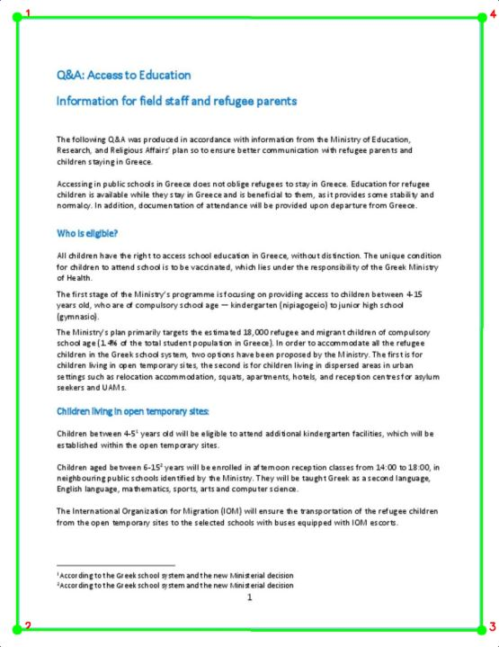
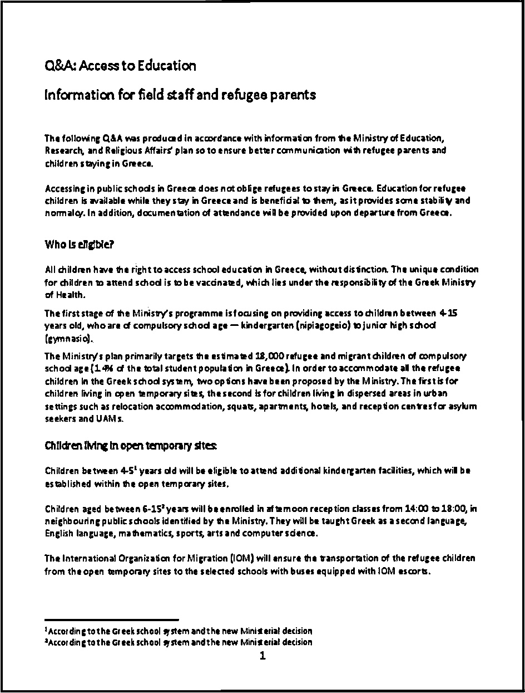

# 📄 Smart Document Scanner

A professional web-based document scanner application that automatically detects, transforms, and exports document images as clean scanned copies. Built with Streamlit and OpenCV for real-time document processing and instant results.


## 🎯 Project Overview

This project transforms smartphone photos of documents into professional, scan-quality images through intelligent edge detection and perspective correction. The solution provides instant document scanning capabilities directly in your browser, eliminating the need for physical scanners or complex software installations.

## ✨ Key Features

- **Automatic Document Detection**: Intelligent edge detection using Canny algorithm and contour approximation to find document boundaries
- **Perspective Correction**: Four-point perspective transformation for accurate document alignment and bird's-eye view
- **Multiple Scan Modes**: Black & White for text documents, Enhanced B&W for documents with backgrounds
- **Real-time Processing**: Instant preview with corner detection visualization (green markers)
- **Multi-Format Export**: Download scanned documents as JPG, PNG, or PDF
- **Noise Reduction**: Adjustable morphological operations (0-5 levels) to remove artifacts and grain
- **Clean Interface**: Intuitive sidebar controls with responsive two-column layout

## 🛠️ Tools & Technologies

- **Streamlit**: Web application framework and user interface
- **OpenCV (opencv-python-headless)**: Image processing and computer vision algorithms
- **NumPy**: Numerical computing and array operations
- **Pillow (PIL)**: Image manipulation and format conversion
- **Python 3.8+**: Core programming language

## 🎥 Demo Video

Watch the document scanner in action:

**[📹 View Demo Video](https://github.com/komal-sukheja/document-scanner/releases/download/v1.0.0/demo-video.mp4)**

*The video demonstrates the complete workflow: uploading documents, automatic detection, scan mode selection, and multi-format export.*

## 📊 How It Works

### Document Processing Pipeline

1. **Image Upload**
   - Supports JPG, PNG, and JPEG formats
   - File size handled efficiently for web deployment

2. **Automatic Detection**
   - Converts image to grayscale
   - Applies Gaussian blur (5x5 kernel) for noise reduction
   - Canny edge detection (thresholds: 75, 200)
   - Finds contours and identifies largest 4-sided shape

3. **Perspective Transformation**
   - Orders corner points (top-left, top-right, bottom-right, bottom-left)
   - Calculates optimal output dimensions
   - Applies perspective transform matrix for bird's-eye view

4. **Scan Processing**
   - **Black & White Mode**: Adaptive Gaussian thresholding (block size: 11, C: 2)
   - **Enhanced B&W Mode**: Adaptive mean thresholding (block size: 15, C: 10)
   - Morphological operations (closing + opening) for noise removal

5. **Export**
   - PIL-based format conversion
   - High-quality JPEG (95% quality), PNG, or PDF output

## 📂 Project Structure

```
document-scanner/
│
├── app.py                      # Main application with processing logic
├── requirements.txt            # Python dependencies
├── .streamlit/                 # Streamlit configuration
│   └── config.toml
├── demo/
│   └── demo-video.mp4         # Functionality demonstration
├── sample_images/             # Sample documents for testing
│   ├── article.JPG
│   ├── doc.jpg
│   ├── doc1.JPG
│   ├── hanwritten-notes.jpg
│   ├── hanwritten-notes1.jpg
│   ├── note.JPG
│   └── receipt.JPG
├── screenshots/               # Application screenshots
│   ├── original-detection.JPG
│   └── scanned_document.jpg
├── .gitignore                 # Git ignore rules
└── README.md                  # Project documentation
```

## 🎓 Skills Demonstrated

- Computer vision and image processing
- Edge detection and contour approximation
- Perspective transformation algorithms
- Web application development with Streamlit
- Session state management
- Multi-format file handling
- UI/UX design for user-friendly interfaces

## 📸 Screenshots

### Original Document with Detection
The app automatically identifies document boundaries with numbered corner markers:



### Scanned Output
Clean, professionally processed document with perspective correction:



## 🚀 How to Use

### Option 1: Use Live Deployment

Visit the deployed application: **[🌐 Live Demo](https://smart-document-scanner.streamlit.app/)**

### Option 2: Run Locally

1. **Clone the repository**
   ```bash
   git clone https://github.com/komal-sukheja/document-scanner.git
   cd document-scanner
   ```

2. **Create virtual environment** (recommended)
   ```bash
   # Windows
   python -m venv scanenv
   scanenv\Scripts\activate

   # macOS/Linux
   python3 -m venv scanenv
   source scanenv/bin/activate
   ```

3. **Install dependencies**
   ```bash
   pip install -r requirements.txt
   ```

4. **Run the application**
   ```bash
   streamlit run app.py
   ```

   The app will open in your browser at `http://localhost:8501`

### Using the Scanner

1. **Upload Document**: Click "Upload Document Image" and select a photo
2. **Verify Detection**: Check green corner markers on the original image
3. **Adjust Settings** (if needed):
   - Choose scan mode based on document type
   - Adjust noise reduction (higher = cleaner, may lose detail)
4. **Export**: Click "Export Document" and select format (JPG/PNG/PDF)
5. **Reset**: Use reset corners button if detection is incorrect

### Tips for Best Results

- 📷 Ensure good, even lighting when photographing documents
- 🖼️ Capture all four corners clearly in the frame
- 📐 Place documents on contrasting backgrounds (e.g., white paper on dark desk)
- 🎯 Use **Black & White** for text-heavy documents (contracts, forms)
- 🌈 Use **Enhanced B&W** for documents with colored or patterned backgrounds
- 🧹 Start with noise reduction at 2, adjust based on output quality

## 🚀 Deployed on Streamlit Cloud

This application is live and accessible at: **[smart-document-scanner.streamlit.app](https://smart-document-scanner.streamlit.app/)**


## 🐛 Known Limitations

- Detection may fail on very low-light or blurry images
- Complex backgrounds might require manual adjustment (feature planned)
- PDF export limited to single page per scan
- Maximum upload size: 200MB (Streamlit Cloud default)

## 📝 Future Enhancements

- [ ] Manual corner adjustment with interactive drag-and-drop
- [ ] Batch processing for multiple documents
- [ ] OCR integration for text extraction and searchable PDFs
- [ ] Document type classification (invoice, receipt, contract)
- [ ] Cloud storage integration (Google Drive, Dropbox)
- [ ] Mobile-responsive layout optimization


## 📧 Connect With Me

- **LinkedIn**: [Komal Sukheja](https://www.linkedin.com/in/komal-sukheja/)
- **Email**: komalsukheja2001@gmail.com
- **GitHub**: [@komal-sukheja](https://github.com/komal-sukheja)

---

⭐ If you found this project useful, please consider giving it a star!
